# Zorvyn Finance Dashboard — Backend API

> Enterprise-grade **Finance Dashboard Backend** built as a **Modular Monolith** with Spring Boot 3.3.5 and Java 21.
> Designed with production-ready patterns: RBAC, JWT auth, caching, rate limiting, audit logging, and idempotency.

---

## Table of Contents
1. [Project Overview](#project-overview)
2. [Architecture Decision — Modular Monolith](#architecture-decision)
3. [Module Breakdown](#module-breakdown)
4. [Security Design](#security-design)
5. [Design Patterns](#design-patterns)
6. [Performance & Optimization](#performance--optimization)
7. [API Reference](#api-reference)
8. [Error Handling](#error-handling)
9. [Trade-offs](#trade-offs)
10. [Scalability Plan](#scalability-plan)
11. [Local Setup](#local-setup)
12. [Docker Setup](#docker-setup)

---

## Project Overview

Zorvyn Finance Dashboard is a RESTful backend API that allows users to:
- **Track income and expenses** with detailed categorization
- **View aggregated analytics** — total income/expenses, net balance, category breakdowns, monthly trends
- **Manage users** with Role-Based Access Control (VIEWER / ANALYST / ADMIN)

### Tech Stack
| Component | Technology |
|---|---|
| Framework | Spring Boot 3.3.5 |
| Language | Java 21 |
| Database | PostgreSQL (prod) / H2 in-memory (dev) |
| Migrations | Flyway |
| Auth | JWT (JJWT), BCrypt |
| Caching | Caffeine (in-process, 5-min TTL) |
| Rate Limiting | Bucket4j (token bucket, per-IP) |
| API Docs | Springdoc OpenAPI 3 (Swagger UI) |
| Build | Maven |
| Containerization | Docker + Docker Compose |

---

## Architecture Decision


*(Please save your architecture diagram as `docs/architecture.png` to display it above)*

### Why Modular Monolith?

| Factor | Modular Monolith | Microservices |
|---|---|---|
| **Complexity** | Low — single deployable | High — distributed systems, network latency |
| **Data consistency** | ACID transactions across modules | Eventual consistency, saga patterns needed |
| **Operational overhead** | Single process, easy debugging | Kubernetes, service mesh, distributed tracing |
| **Team size** | Ideal for small teams | Better for large independent teams |
| **Performance** | In-process calls (nanoseconds) | Network calls (milliseconds) |
| **Iteration speed** | Fast — shared codebase | Slow — API contracts between services |

**Decision:** A Modular Monolith gives the **structural benefits of microservices** (clear module boundaries, no cross-module DB access) without the operational complexity. For a finance dashboard at this scale, it's the pragmatic choice.

The modules (`iam`, `finance`, `analytics`, `shared`) are **logically isolated** — each has its own Controller/Service/Repository/DTO layers and modules communicate only through service interfaces, never via direct repository access.

---

## Module Breakdown

```
src/main/java/com/zorvyn/finance/
├── iam/                    # Identity & Access Management
│   ├── api/               # AuthController, UserController
│   ├── application/       # AuthService, UserService, RoleService
│   ├── domain/            # User, Role, Permission, RefreshToken, UserStatus
│   ├── dto/               # LoginRequest, RegisterRequest, UserResponse, LoginResponse
│   ├── mapper/            # UserMapper
│   └── repository/        # UserRepository, RoleRepository, RefreshTokenRepository
│
├── finance/               # Financial Records (Core)
│   ├── api/               # FinancialRecordController
│   ├── application/       # FinancialRecordService
│   ├── domain/            # FinancialRecord, RecordType, RecordCategory
│   ├── dto/               # CreateRecordRequest, UpdateRecordRequest, RecordResponse, RecordFilterCriteria
│   ├── mapper/            # RecordMapper
│   ├── repository/        # FinancialRecordRepository (JPQL aggregate queries)
│   └── specification/     # RecordSpecification (JPA Criteria API)
│
├── analytics/             # Dashboard & Aggregations
│   ├── api/               # DashboardController
│   ├── application/       # DashboardService (with @Cacheable)
│   └── dto/               # DashboardSummaryResponse, CategoryBreakdownResponse, MonthlyTrendResponse
│
└── shared/                # Cross-cutting concerns
    ├── audit/             # AuditLog, AuditEventService, AuditLogRepository
    ├── config/            # SecurityConfig, CacheConfig, OpenApiConfig, JacksonConfig, DataSeeder
    ├── domain/            # BaseEntity (auditing), DomainEvent (event-driven base)
    ├── dto/               # ApiResponse<T>, ErrorResponse, PagedResponse<T>
    ├── exception/         # GlobalExceptionHandler + all custom exceptions
    ├── filter/            # RateLimitFilter, CorrelationIdFilter, RequestLoggingFilter
    ├── idempotency/       # IdempotencyFilter, IdempotencyService, IdempotencyKey
    └── security/          # JwtTokenProvider, JwtAuthenticationFilter, UserPrincipal, SecurityUtils
```

---

## Security Design

### Authentication Flow
```
1. POST /api/v1/auth/register → create user (VIEWER role by default)
2. POST /api/v1/auth/login    → validate credentials → issue access token (15 min) + refresh token (7 days)
3. Include header: Authorization: Bearer <accessToken>
4. POST /api/v1/auth/refresh  → exchange refresh token for new token pair
5. POST /api/v1/auth/logout   → blacklist access token + revoke all refresh tokens
```

### JWT Details
- **Algorithm**: HS512 (HMAC SHA-512)
- **Access token TTL**: 15 minutes (configurable via `JWT_ACCESS_EXPIRY`)
- **Refresh token TTL**: 7 days (configurable via `JWT_REFRESH_EXPIRY`)
- **Token blacklist**: In-memory (ConcurrentHashMap) for revoked access tokens

### Password Security
- **Algorithm**: BCrypt with work factor **12** (≈250ms per hash — resistant to brute force)
- Passwords are **never stored** or logged in plaintext

### RBAC (Role-Based Access Control)
| Endpoint Group | VIEWER | ANALYST | ADMIN |
|---|:---:|:---:|:---:|
| `POST /auth/**` | ✅ (public) | ✅ | ✅ |
| `GET /auth/me` | ✅ | ✅ | ✅ |
| `GET /dashboard/summary` | ✅ | ✅ | ✅ |
| `GET /dashboard/recent-activity` | ✅ | ✅ | ✅ |
| `GET /dashboard/category-breakdown` | ❌ 403 | ✅ | ✅ |
| `GET /dashboard/monthly-trends` | ❌ 403 | ✅ | ✅ |
| `GET /records/**` | ❌ 403 | ✅ | ✅ |
| `POST /records` | ❌ 403 | ❌ 403 | ✅ |
| `PUT /records/{id}` | ❌ 403 | ❌ 403 | ✅ |
| `DELETE /records/{id}` | ❌ 403 | ❌ 403 | ✅ |
| `GET, PUT, DELETE /users/**` | ❌ 403 | ❌ 403 | ✅ |

RBAC is enforced at two levels:
1. **URL-level**: `SecurityConfig.authorizeHttpRequests()` — first line of defence
2. **Method-level**: `@PreAuthorize("hasRole('ADMIN')")` — defence in depth

### Additional Security Features
- **Rate Limiting**: 100 requests/minute per IP (Bucket4j token bucket). Returns `429 Too Many Requests` with `Retry-After` header.
- **CORS**: Whitelist-based (configured via `CORS_ORIGINS` env var)
- **CSRF**: Disabled (stateless JWT API)
- **OWASP Headers**: `X-Frame-Options: DENY`, `X-Content-Type-Options`, `Strict-Transport-Security`
- **Correlation IDs**: Every request gets `X-Correlation-ID` for distributed tracing
- **Idempotency**: `Idempotency-Key` header on `POST /records` prevents duplicate records on retry

---

## Design Patterns

### 1. Repository Pattern (JPA)
All data access goes through Spring Data JPA repository interfaces. Custom JPQL queries are defined in `FinancialRecordRepository` for aggregate analytics, keeping business logic out of the service layer.

### 2. Specification Pattern (Filtering)
`RecordSpecification` implements the **Specification Pattern** using JPA Criteria API. Filters are independent, composable predicates combined with AND logic:
```java
Specification<FinancialRecord> spec = RecordSpecification.fromCriteria(criteria);
// Builds: WHERE deleted_at IS NULL AND type = 'INCOME' AND transaction_date >= '2024-01-01'
```
**Benefits**: No SQL injection risk (parameterized queries), dynamic query composition without string concatenation.

### 3. Domain Event Pattern (Event-Driven)
`DomainEvent` is the abstract base class for all domain events. Events carry a `correlationId` for tracing. The `AuditEventService` records all mutating actions (`RECORD_CREATED`, `RECORD_UPDATED`, `RECORD_DELETED`) asynchronously using `@Async` with a separate transaction (`REQUIRES_NEW`) so audit failures never impact the main business flow.

### 4. Strategy Pattern (RBAC & Type Handling)
Transaction types (`INCOME` / `EXPENSE`) drive different behaviour throughout the system:
- Analytics aggregations group by `RecordType`
- Dashboard summary calculates `net = totalIncome - totalExpenses`
- Category breakdown computes percentages independently per type

### 5. Factory-like Data Seeder
`DataSeeder` implements `CommandLineRunner` to seed the database with default roles (VIEWER, ANALYST, ADMIN) and test users on startup — a factory pattern for test data bootstrapping.

### 6. Layered Architecture
```
HTTP Request → Controller (DTO validation) → Service (business logic) → Repository (data) → DB
                    ↓                              ↓
               @ApiResponses              @CacheEvict / @Cacheable
               @PreAuthorize              @Transactional
               @Valid                     AuditEventService.logAction()
```

---

## Performance & Optimization

### 1. Database Indexing
Six indexes on `financial_records` for common query patterns:
```sql
CREATE INDEX idx_records_user_id         ON financial_records(user_id);
CREATE INDEX idx_records_type            ON financial_records(type);
CREATE INDEX idx_records_category        ON financial_records(category);
CREATE INDEX idx_records_transaction_date ON financial_records(transaction_date);
CREATE INDEX idx_records_deleted_at      ON financial_records(deleted_at);
CREATE INDEX idx_records_composite       ON financial_records(user_id, type, transaction_date, deleted_at);
```

### 2. Aggregation Queries (Not Java Loops)
Dashboard analytics use JPQL aggregate queries, pushing computation to the database:
```java
// FinancialRecordRepository
@Query("SELECT SUM(r.amount) FROM FinancialRecord r WHERE r.type = 'INCOME' AND r.deletedAt IS NULL ...")
BigDecimal calculateTotalIncome(LocalDate start, LocalDate end);
```
**Not**: loading all records into memory and summing in Java.

### 3. Caffeine Cache (Dashboard Only)
Dashboard endpoints are cached with a 5-minute TTL using Caffeine:
```java
@Cacheable(value = "dashboardSummary", key = "#startDate + '-' + #endDate")
public DashboardSummaryResponse getSummary(LocalDate startDate, LocalDate endDate) { ... }
```
Cache is evicted on every write (`@CacheEvict` in `FinancialRecordService`).

**Why dashboard only?** Records are user-specific and frequently mutated — caching them would add complexity (per-user cache keys, frequent invalidation). The dashboard aggregates are expensive to compute and change only when records change.

### 4. Pagination Everywhere
All list endpoints use `Pageable` with configurable page size (default: 20). Prevents loading unbounded result sets into memory.

### 5. Read-Only Transactions
All `GET` operations use `@Transactional(readOnly = true)`, allowing Hibernate to skip dirty-checking and the database to use read-only optimizations.

### 6. Optimistic Locking
`FinancialRecord` uses a `version` field for optimistic locking. Concurrent updates throw `ObjectOptimisticLockingFailureException` (mapped to 409 Conflict) — no pessimistic locks needed.

---

## API Reference

| Method | Endpoint | Role | Description |
|---|---|---|---|
| POST | `/api/v1/auth/register` | Public | Create account |
| POST | `/api/v1/auth/login` | Public | Get JWT tokens |
| POST | `/api/v1/auth/refresh` | Public | Refresh token pair |
| POST | `/api/v1/auth/logout` | Authenticated | Revoke tokens |
| GET | `/api/v1/auth/me` | Authenticated | Current user profile |
| GET | `/api/v1/records` | ANALYST, ADMIN | List + filter records |
| POST | `/api/v1/records` | ADMIN | Create record |
| GET | `/api/v1/records/{id}` | ANALYST, ADMIN | Get record by ID |
| PUT | `/api/v1/records/{id}` | ADMIN | Update record |
| DELETE | `/api/v1/records/{id}` | ADMIN | Soft-delete record |
| GET | `/api/v1/dashboard/summary` | All authenticated | Income/expense/net summary |
| GET | `/api/v1/dashboard/category-breakdown` | ANALYST, ADMIN | Category-wise totals |
| GET | `/api/v1/dashboard/monthly-trends` | ANALYST, ADMIN | Month-by-month trends |
| GET | `/api/v1/dashboard/recent-activity` | All authenticated | Latest transactions |
| GET | `/api/v1/users` | ADMIN | List all users |
| GET | `/api/v1/users/{id}` | ADMIN | Get user by ID |
| PUT | `/api/v1/users/{id}` | ADMIN | Update user |
| PATCH | `/api/v1/users/{id}/status` | ADMIN | Change user status |
| DELETE | `/api/v1/users/{id}` | ADMIN | Soft-delete user |

**Interactive docs**: You can view the interactive Swagger UI and test the APIs by visiting: [http://localhost:8080/swagger-ui/index.html](http://localhost:8080/swagger-ui/index.html)


*(Please save the provided screenshot as `docs/swagger-ui.png` to display it here)*

---

## Error Handling

All errors return a consistent `ErrorResponse` envelope:
```json
{
  "success": false,
  "message": "Validation failed",
  "errorCode": "VALIDATION_ERROR",
  "path": "/api/v1/records",
  "timestamp": "2024-04-01T12:00:00Z",
  "fieldErrors": {
    "amount": "Amount must be greater than 0"
  }
}
```

| HTTP Status | Error Code | Trigger |
|---|---|---|
| 400 | `VALIDATION_ERROR` | `@Valid` constraint violated |
| 400 | `INVALID_PARAMETER` | Wrong type for query param |
| 401 | `AUTHENTICATION_FAILED` | Missing/invalid JWT |
| 401 | `BAD_CREDENTIALS` | Wrong email/password |
| 403 | `ACCESS_DENIED` | Insufficient role |
| 404 | `RESOURCE_NOT_FOUND` | Entity doesn't exist or is soft-deleted |
| 409 | `DUPLICATE_RESOURCE` | Email already registered |
| 409 | `IDEMPOTENCY_CONFLICT` | Duplicate Idempotency-Key |
| 409 | `OPTIMISTIC_LOCK_CONFLICT` | Concurrent update detected |
| 422 | `BUSINESS_RULE_VIOLATION` | Domain rule violated |
| 429 | `RATE_LIMIT_EXCEEDED` | > 100 req/min per IP |
| 500 | `INTERNAL_ERROR` | Unexpected server error |

---

## Trade-offs

### 1. Caffeine vs Redis
- **Chose Caffeine** (in-process cache) over Redis for simplicity — no external infra required.
- **Trade-off**: Cache is not shared across multiple instances. For horizontal scaling, Redis would be needed.
- **Mitigation**: The architecture supports swapping CacheManager to RedissonClient with a single config change.

### 2. In-Memory Token Blacklist
- Access tokens are blacklisted in a `ConcurrentHashMap`.
- **Trade-off**: Lost on restart; not shared across instances.
- **Mitigation**: Short TTL (15 min) limits exposure. For multi-instance, move to Redis.

### 3. Soft Delete vs Hard Delete
- All deletes are soft (set `deletedAt`). Data is retained for audit compliance.
- **Trade-off**: Tables grow over time. Requires `deletedAt IS NULL` in all queries.
- **Mitigation**: `idx_records_deleted_at` index makes these filters cheap.

### 4. H2 in Dev vs PostgreSQL in Prod
- Dev mode uses H2 in-memory for zero-setup local development.
- **Trade-off**: Some PostgreSQL-specific features (jsonb, full-text search) can't be prototyped in dev.
- **Mitigation**: `application-prod.yml` uses PostgreSQL via `DB_HOST` env var.

---

## Scalability Plan

### Vertical (Current Architecture Supports)
- Increase connection pool size (`HikariCP`)
- Tune Caffeine cache size and TTL
- Add read replicas (point `@Transactional(readOnly=true)` at replica)

### Horizontal Scaling Path
1. **Session**: Already stateless (JWT) — no session affinity needed
2. **Cache**: Swap Caffeine → Redis (`spring-boot-starter-data-redis`)
3. **Token blacklist**: Move to Redis with TTL equal to access token lifetime
4. **Rate limiting**: Move per-IP buckets to Redis (Bucket4j + Redis)
5. **Async tasks**: Replace `@Async` → message queue (RabbitMQ/Kafka) for audit events

### Microservices Extraction Path
When team grows, modules can be extracted:
1. `iam` → Auth Service (owns `users`, `roles`, `refresh_tokens`)
2. `finance` → Records Service (owns `financial_records`)
3. `analytics` → Analytics Service (read-only replica, CQRS)

Service communication via REST or events (Kafka). Module boundaries are already clean — no cross-module DB joins.

---

## Local Setup

### Prerequisites
- Java 21+
- Maven 3.9+

### Run (H2 in-memory, no dependencies)
```bash
git clone <repo>
cd zorvyn-finance-backend
mvn spring-boot:run
```

App starts at `http://localhost:8080`
Swagger UI: `http://localhost:8080/swagger-ui.html`
H2 Console: `http://localhost:8080/h2-console` (JDBC URL: `jdbc:h2:mem:zorvyn_finance`)

### Pre-seeded Test Accounts
| Email | Password | Role |
|---|---|---|
| `admin@zorvyn.com` | `Admin@123!` | ADMIN |
| `analyst@zorvyn.com` | `Analyst@123!` | ANALYST |
| `viewer@zorvyn.com` | `Viewer@123!` | VIEWER |

---

## Docker Setup

### Start with PostgreSQL (production-like)
```bash
# Start only the database
docker-compose up -d postgres

# Run the app locally against the Docker DB
DB_HOST=localhost DB_PORT=5432 mvn spring-boot:run -Dspring.profiles.active=prod
```

### Start full stack (app + DB)
```bash
docker-compose up --build
```

App: `http://localhost:8080`
Swagger: `http://localhost:8080/swagger-ui.html`

### Environment Variables
| Variable | Default | Description |
|---|---|---|
| `SERVER_PORT` | `8080` | HTTP port |
| `DB_HOST` | `localhost` | PostgreSQL host |
| `DB_PORT` | `5432` | PostgreSQL port |
| `DB_NAME` | `zorvyn_finance` | Database name |
| `DB_USERNAME` | `zorvyn` | DB username |
| `DB_PASSWORD` | `zorvyn_secret` | DB password |
| `JWT_SECRET` | (long default) | HS512 signing key (min 512 bits) |
| `JWT_ACCESS_EXPIRY` | `900000` | Access token TTL in ms (15 min) |
| `JWT_REFRESH_EXPIRY` | `604800000` | Refresh token TTL in ms (7 days) |
| `RATE_LIMIT_RPM` | `100` | Requests per minute per IP |
| `CORS_ORIGINS` | `http://localhost:3000` | Allowed CORS origins |
